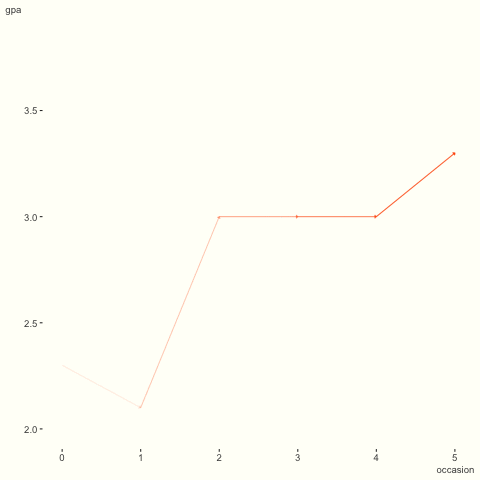
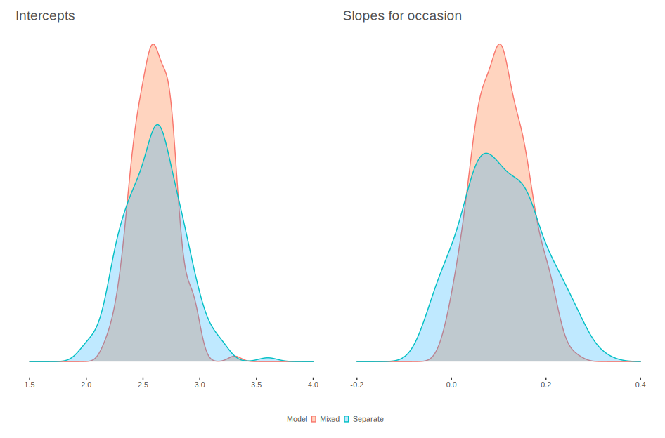
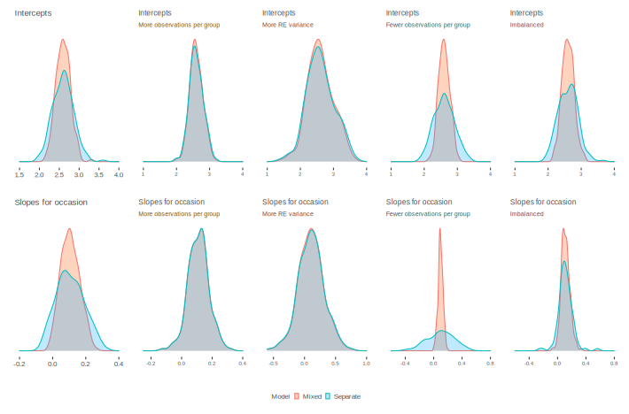

```{r chunk_setup-ran-slope, include=FALSE, eval=TRUE}
knitr::opts_chunk$set(
  # cache
  cache.rebuild = FALSE,
  cache         = TRUE
)
```

# More Random Effects


Previously we've looked at random intercepts, but any observation or lower level covariate effect could be allowed to vary by cluster as well.  This is identical in concept to an *interaction*, where the effect of some feature is allowed to vary by the levels/values of another.


## Application

Returning to the GPA data, recall the visualization from before.  I've animated it to highlight the differences among students. We can see that while there is general increase over time, some are relatively flat or otherwise take a not so straightforward path.  How might we begin to capture this sort of phenomenon?


```{r spaghetti2-anim, echo=FALSE, eval=FALSE}
options(gganimate.dev_args = list(bg = '#fffff8'))
p = gpa %>%
  slice(1:120) %>%   # if you don't want to wait
  ggplot(aes(x = occasion, y = gpa)) +
  geom_path(aes(group = student, alpha = occasion),
            color = '#ff5500',
            size = 1.5,
            arrow = arrow(type = 'closed',
                          angle = 45,
                          length = unit(2, 'points')),
            show.legend = F) +
  # geom_smooth(
  #   aes(alpha = occasion),
  #   se = F,
  #   color = 'darkred',
  #   show.legend = F
  # ) +
  transition_time(as.integer(student)) +
  shadow_mark(colour = 'gray50', size = 0.25) +
  theme_clean()

# trying to get better resolution without making the file size notably larger is
# mostly a lost cause.
p = animate(
  p,
  res = 360,
  # width = 300,
  # height = 200,
  # units = 'px'
)

anim_save('img/gpa_anim_test.gif', animation = p)
```

```{r spaghetti2-anim-show, echo=F, out.width='50%', dpi=720}

```

<br>

To do so, let's now assume that the trend over time is allowed to vary by student, in addition to the intercepts.  Using <span class="pack">lme4</span>, this is quite straightforward.

```{r random_slope, eval=FALSE}
gpa_mixed =  lmer(gpa ~ occasion + (1 + occasion | student), data = gpa)
summary(gpa_mixed)
```

Pretty easy huh? Within the parenthesis, to the left of that bar `|` we are just positing a model formula as we would do with most modeling functions[^nointneeded]. Let's look at the results.


```{r random_slope_summary, echo=FALSE}
gpa_mixed =  lmer(gpa ~ occasion + (1 + occasion | student), data = gpa)

extract_fixed_effects(gpa_mixed) %>% 
  select(-(t:p_value)) %>% 
  kable_df()

extract_vc(gpa_mixed, ci_level = 0) %>% 
  kable_df()

# gpa_mixed %>%
#   tidy('fixed', conf.int=T) %>%
#   kable_df()
# 
# 
# data.frame(VarCorr(gpa_mixed)) %>% 
#   slice(-3) %>%  
#   select(-var2) %>% 
#   rename(variance=vcov, sd=sdcor, re=var1) %>%  
#   mutate_all(function(x) ifelse(is.na(x), '', x)) %>%
#   data.frame %>%
#   kable_df()
```

As before, since we have 0 as our starting semester, the intercept tells us what the average GPA is in the first semester.  The coefficient for occasion still reflects a one semester change in GPA.  As we have not changed the fixed effect portion of the model, the values are the same as before.

The associated intercept variance tells us how much that starting GPA bounces around from student to student. The variance for the occasion effect might not look like much in comparison, but slopes are on a notably different scale than the intercept.  Note that the mean slope for the semester to semester effect, our fixed effect, is `r round(fixef(gpa_mixed)[2], 2)`, but from student to student it bounces around half that.  So we could expect most students to fall somewhere between a flat effect of zero to more than double the population average[^sdslopes]. 

Yet another point of interest is the correlation of the intercepts and slopes. In this case it's `r data.frame(VarCorr(gpa_mixed)) %>% slice(3) %>% select(sdcor) %>%  round(2)`. That's pretty small, but the interpretation is the same as with any correlation.  In this case specifically, it tells us that those with lower intercepts would be associated with increased time trajectories.   This makes intuitive sense in that people are improving in general, and those at the bottom would have more room to improve.  However, this is very slight, and practically speaking we might not put too much weight on it.


## Comparison to many regressions


Let's compare these results to the ones we would have gotten had we run a separate regression for each student.  In what follows we see the distribution of of the estimated intercept and slope coefficients for all the students.  Note that these are the same estimates one would have gotten with a fixed effects model with an occasion by student interaction[^fe_comparison].

```{r ranints_vs_separateints, echo=FALSE, eval=FALSE}
gint = tibble(
  Mixed = extract_random_coefs(gpa_mixed) %>% filter(effect == 'Intercept') %>% pull(value),
  Separate = gpa_lm_by_group %>% pull(Intercept)
) %>%
  pivot_longer(everything(),  names_to= 'Model', values_to = 'Intercept') %>%
  ggplot(aes(x = Intercept)) +
  geom_density(aes(color = Model, fill = Model), alpha = .25) +
  scale_fill_manual(values = c(palettes$orange$orange, palettes$orange$complementary[2])) +
  labs(x = '', y = '', title = 'Intercepts') +
  xlim(c(1.5, 4)) +
  theme_clean() +
  theme(
    axis.text.x = element_text(size = 8),
    axis.text.y = element_blank(),
    axis.ticks.y = element_blank(),
    legend.key.size = unit(2, 'mm'),
    legend.title = element_text(size = 8),
    legend.text = element_text(size = 8),
    legend.box.spacing = unit(0, 'in'),
    legend.position = 'bottom', #c(.85, .75),
    title = element_text(size = 12)
  )

gslopes = tibble(
  Mixed = extract_random_coefs(gpa_mixed) %>% filter(effect == 'occasion') %>% pull(value),
  Separate = gpa_lm_by_group %>% pull(occasion)
) %>%
  pivot_longer(everything(),  names_to = 'Model', values_to = 'Occasion') %>%
  ggplot(aes(x = Occasion)) +
  geom_density(aes(color = Model, fill = Model),
               alpha = .25,
               # show.legend = FALSE
               )+
  scale_fill_manual(values = c(palettes$orange$orange, palettes$orange$complementary[2])) +
  labs(x = '', y = '', title = 'Slopes for occasion') +
  guides(color = 'none', fill = 'none') +
  xlim(c(-.2, .4)) +
  theme_clean() +
  theme(
    axis.text.x = element_text(size = 8),
    axis.text.y = element_blank(),
    axis.ticks.y = element_blank(),
    title = element_text(size = 12),
    # legend.key.size = unit(2, 'mm'),
    # legend.title = element_text(size = 8),
    # legend.text = element_text(size = 8),
    # legend.box.spacing = unit(0, 'in'),
    # legend.position = 'bottom', #c(.85, .75),
  )

gint + 
  gslopes + 
  plot_layout(guides = 'collect')  & 
  theme(legend.position = 'bottom')

ggsave('img/shrinkage_main.svg')
```

```{r shrinkage_main, out.width='125%', echo = F}

```


Here we can see that the mixed model intercepts are generally not as extreme, i.e. the tails of the distribution have been pulled toward the overall effect.  Same goes for the slopes. In both cases the mixed model shrinks what would have been the by-group estimate, which would otherwise overfit in this scenario.  This *regularizing* effect is yet another bonus when using mixed models[^pool].  It comes into play largely when we have few observations per group and less estimated variance for the random effects.  In other words, when there is little information in a group, or less group-level variance relative to the observation variance, then the mixed model will produce a group-specific effect that is closer to the overall population effect.  In that sense, the mixed model group coefficients better reflect our ignorance.  Conversely, with more pronounced group effects, our uncertainty about the overall effect increases.  


The following shows what would happen to similar data under a variety of settings with simulated data that is based on the results of the GPA model we had above. On the far left is the plot just shown, our current data setting. Then there are four settings to go along with the original results. The first shows what would happen had we taken many more measurements per student. In the next, we add to the intercept and slope variance, and decrease the residual variance, but keep the sample size the same as the original data.  In both cases we have a less regularizing effect of the mixed model. The random coefficients are very similar to the separate regressions results.  Then, we keep the data the same but where we only have 4 observations per student, which shows more variability in the per-student results, and with it relatively more shrinkage with the mixed model. Finally, we add to the number of occasions per student (10), but have dropout over time, and so have roughly the same amount of data, but which is imbalanced.  For more on this see topic, see my post [here](https://m-clark.github.io/posts/2019-05-14-shrinkage-in-mixed-models/).


```{r ranints_vs_separateints_more_npg, echo=FALSE, eval=FALSE}
set.seed(1234)
Nstudent = 200
NperGroup = 100
N = Nstudent * NperGroup

student = factor(rep(1:Nstudent, each = NperGroup))
u = mvtnorm::rmvnorm(Nstudent, sigma = matrix(c(.2 ^ 2,-.1 * .2 * .067,-.1 *
                                                  .2 * .067, .067 ^ 2), 2, 2))
e = rnorm(N, sd = .25)
occasion = rep(0:(NperGroup - 1), Nstudent)
y = (2.6 + u[student, 1]) + (.11 + u[student, 2]) * occasion + e

d = data.frame(occasion, y, student)

model = lmer(y ~ occasion + (1 + occasion | student), data = d)

separate_lm = d %>% 
  split(.$student) %>% 
  map_df(~data.frame(t(coef(lm(y ~ occasion, data=.))))) %>% 
  rename(Intercept = X.Intercept.)

gint_more_npg = tibble(
  Mixed = extract_random_coefs(model) %>% filter(effect == 'Intercept') %>% pull(value),
  Separate = separate_lm %>% pull(Intercept)
) %>%
  pivot_longer(everything(),  names_to= 'Model', values_to = 'Intercept') %>% 
  ggplot(aes(x = Intercept)) +
  geom_density(aes(color = Model, fill = Model),
               alpha = .25,
               show.legend = F) +
  scale_fill_manual(values = c(palettes$orange$orange, palettes$orange$complementary[2])) +
  labs(x = '', y = '', title = 'Intercepts', subtitle = 'More observations per group') +
  xlim(c(1, 4)) +
  theme_clean() +
  theme(
    axis.text.x  = element_text(size = 6),
    axis.text.y  = element_blank(),
    axis.ticks.y = element_blank(),
    legend.key.size    = unit(2, 'mm'),
    legend.title       = element_text(size = 8),
    legend.text        = element_text(size = 8),
    legend.box.spacing = unit(0, 'in'),
    legend.position    = c(.75, .75),
    title = element_text(size = 7)
  )

gslopes_more_npg = tibble(
  Mixed = extract_random_coefs(model) %>% filter(effect == 'occasion') %>% pull(value),
  Separate = separate_lm %>% pull(occasion)
) %>%
  pivot_longer(everything(),  names_to = 'Model', values_to = 'occasion') %>%
  ggplot(aes(x = occasion)) +
  geom_density(aes(color = Model, fill = Model),
               alpha = .25,
               show.legend = F) +
  scale_fill_manual(values = c(palettes$orange$orange, palettes$orange$complementary[2])) +
  labs(x = '', y = '', title = 'Slopes for occasion', subtitle = 'More observations per group') +
  xlim(c(-.25, .4)) +
  theme_clean() +
  theme(
    axis.text.x  = element_text(size = 6),
    axis.text.y  = element_blank(),
    axis.ticks.y = element_blank(),
    title = element_text(size = 7)
  )

# gint_more_npg + gslopes_more_npg
```

```{r ranints_vs_separateints_more_re, echo=FALSE, eval=FALSE}
set.seed(1234)
Nstudent  = 200
NperGroup = 6
N = Nstudent * NperGroup

student = factor(rep(1:Nstudent, each = NperGroup))
u = mvtnorm::rmvnorm(Nstudent, sigma = matrix(c(.4 ^ 2,-.1 * .4 * .2,-.1 *
                                                  .4 * .2, .2 ^ 2), 2, 2))
e = rnorm(N, sd = .15)
occasion = rep(0:(NperGroup - 1), Nstudent)
y = (2.6 + u[student, 1]) + (.11 + u[student, 2]) * occasion + e

d = data.frame(occasion, y, student)

model = lmer(y ~ occasion + (1 + occasion |student), data=d)

separate_lm = d %>% 
  split(.$student) %>% 
  map_df(~data.frame(t(coef(lm(y ~ occasion, data=.))))) %>% 
  rename(Intercept = X.Intercept.)

gint_more_re = tibble(
  Mixed = extract_random_coefs(model) %>% filter(effect == 'Intercept') %>% pull(value),
  Separate = separate_lm %>% pull(Intercept)
) %>%
  pivot_longer(everything(),  names_to = 'Model', values_to = 'Intercept') %>%
  ggplot(aes(x = Intercept)) +
  geom_density(aes(color = Model, fill = Model),
               alpha = .25,
               show.legend = F) +
  scale_fill_manual(values = c(palettes$orange$orange, palettes$orange$complementary[2])) +
  labs(
    x = '',
    y = '',
    title = 'Intercepts',
    subtitle = 'More RE variance'
  ) +
  xlim(c(1, 4)) +
  theme_clean() +
  theme(
    axis.text.x  = element_text(size = 6),
    axis.text.y  = element_blank(),
    axis.ticks.y = element_blank(),
    legend.key.size    = unit(2, 'mm'),
    legend.title       = element_text(size = 8),
    legend.text        = element_text(size = 8),
    legend.box.spacing = unit(0, 'in'),
    legend.position    = c(.75, .75),
    title = element_text(size = 7)
  )

gslopes_more_re = tibble(
  Mixed = extract_random_coefs(model) %>% filter(effect == 'occasion') %>% pull(value),
  Separate = separate_lm %>% pull(occasion)
) %>%
  pivot_longer(everything(),  names_to = 'Model', values_to = 'occasion') %>%
  ggplot(aes(x = occasion)) +
  geom_density(aes(color = Model, fill = Model),
               alpha = .25,
               show.legend = F) +
  scale_fill_manual(values = c(palettes$orange$orange, palettes$orange$complementary[2])) +
  labs(
    x = '',
    y = '',
    title = 'Slopes for occasion',
    subtitle = 'More RE variance'
  ) +
  xlim(c(-.6, 1)) +
  theme_clean() +
  theme(
    axis.text.x  = element_text(size = 6),
    axis.text.y  = element_blank(),
    axis.ticks.y = element_blank(),
    title = element_text(size = 7)
  )

# gint_more_re + gslopes_more_re
```

```{r ranints_vs_separateints_less_npg, echo=FALSE, eval=FALSE}
set.seed(1234)
Nstudent = 200
NperGroup = 3
N = Nstudent * NperGroup

student = factor(rep(1:Nstudent, each = NperGroup))
u = mvtnorm::rmvnorm(Nstudent, sigma = matrix(c(.2 ^ 2,-.1 * .2 * .067,-.1 *
                                                  .2 * .067, .067 ^ 2), 2, 2))
e = rnorm(N, sd = .25)
occasion = rep(0:(NperGroup - 1), Nstudent)
y = (2.6 + u[student, 1]) + (.11 + u[student, 2]) * occasion + e

d = data.frame(occasion, y, student)

model = lmer(y ~ occasion + (1 + occasion |student), data=d)

separate_lm = d %>% 
  split(.$student) %>% 
  map_df(~data.frame(t(coef(lm(y ~ occasion, data=.))))) %>% 
  rename(Intercept = X.Intercept.)

gint_less_npg = tibble(
  Mixed = extract_random_coefs(model) %>% filter(effect == 'Intercept') %>% pull(value),
  Separate = separate_lm %>% pull(Intercept)
  ) %>%
  pivot_longer(everything(),  names_to = 'Model', values_to = 'Intercept') %>%
  ggplot(aes(x = Intercept)) +
  geom_density(aes(color = Model, fill = Model),
               alpha = .25,
               show.legend = F) +
  scale_fill_manual(values = c(palettes$orange$orange, palettes$orange$complementary[2])) +
  labs(
    x = '',
    y = '',
    title = 'Intercepts',
    subtitle = 'Fewer observations per group'
  ) +
  xlim(c(1, 4)) +
  theme_clean() +
  theme(
    axis.text.x  = element_text(size = 6),
    axis.text.y  = element_blank(),
    axis.ticks.y = element_blank(),
    legend.key.size    = unit(2, 'mm'),
    legend.title       = element_text(size = 8),
    legend.text        = element_text(size = 8),
    legend.box.spacing = unit(0, 'in'),
    legend.position    = c(.75, .75),
    title = element_text(size = 7)
  )

gslopes_less_npg = tibble(
  Mixed = extract_random_coefs(model) %>% filter(effect == 'occasion') %>% pull(value),
  Separate = separate_lm %>% pull(occasion)
  ) %>%
  pivot_longer(everything(),  names_to = 'Model', values_to = 'occasion') %>%
  ggplot(aes(x = occasion)) +
  geom_density(aes(color = Model, fill = Model),
               alpha = .25,
               show.legend = F) +
  scale_fill_manual(values = c(palettes$orange$orange, palettes$orange$complementary[2])) +
  labs(
    x = '',
    y = '',
    title = 'Slopes for occasion',
    subtitle = 'Fewer observations per group'
  ) +
  xlim(c(-.6, .8)) +
  theme_clean() +
  theme(
    axis.text.x  = element_text(size = 6),
    axis.text.y = element_blank(),
    axis.ticks.y = element_blank(),
    title = element_text(size = 7)
  )

# gint_less_npg + gslopes_less_npg
```

```{r ranints_vs_separateints_imbalanced, echo=FALSE, eval=FALSE}
set.seed(1234)  
Nstudent = 200
NperGroup = 10
N = Nstudent * NperGroup

student = factor(rep(1:Nstudent, each = NperGroup))
u = mvtnorm::rmvnorm(Nstudent, sigma = matrix(c(.2 ^ 2, -.1 * .2 * .067, -.1 *
                                                  .2 * .067, .067 ^ 2), 2, 2))
e = rnorm(N, sd = .25)
occasion = rep(0:(NperGroup - 1), Nstudent)
y = (2.6 + u[student, 1]) + (.11 + u[student, 2]) * occasion + e

d = data.frame(occasion, y, student)
d = d %>%
  group_by(student) %>%
  slice(c(1, sample(
    2:10,
    size = sample(1:9,
                  prob = c(.95, .95, .9, .9, .85, .85, rep(.8, 3))),
    prob = c(.95, .95, .9, .85, .80, .75, .7, .6, .5)
  ))) %>% 
  arrange(occasion, .by_group = TRUE)

model = lmer(y ~ occasion + (1 + occasion |student), data=d)

separate_lm = d %>% 
  split(.$student) %>% 
  map_df(~data.frame(t(coef(lm(y ~ occasion, data=.))))) %>% 
  rename(Intercept = X.Intercept.)


gint_imbalanced = tibble(
  Mixed = extract_random_coefs(model) %>% filter(effect == 'Intercept') %>% pull(value),
  Separate = separate_lm %>% pull(Intercept)
  ) %>%
  pivot_longer(everything(),  names_to = 'Model', values_to = 'Intercept') %>%
  ggplot(aes(x = Intercept)) +
  geom_density(aes(color = Model, fill = Model),
               alpha = .25,
               show.legend = F) +
  scale_fill_manual(values = c(palettes$orange$orange, palettes$orange$complementary[2])) +
  labs(
    x = '',
    y = '',
    title = 'Intercepts',
    subtitle = 'Imbalanced'
  ) +
  xlim(c(1, 4)) +
  theme_clean() +
  theme(
    axis.text.x  = element_text(size = 6),
    axis.text.y  = element_blank(),
    axis.ticks.y = element_blank(),
    legend.key.size    = unit(2, 'mm'),
    legend.title       = element_text(size = 8),
    legend.text        = element_text(size = 8),
    legend.box.spacing = unit(0, 'in'),
    legend.position    = c(.75, .75),
    title = element_text(size = 7)
  )

gslopes_imbalanced = tibble(
  Mixed = extract_random_coefs(model) %>% filter(effect == 'occasion') %>% pull(value),
  Separate = separate_lm %>% pull(occasion)
) %>%
  pivot_longer(everything(),  names_to = 'Model', values_to = 'occasion') %>%
  ggplot(aes(x = occasion)) +
  geom_density(aes(color = Model, fill = Model),
               alpha = .25,
               show.legend = F) +
  scale_fill_manual(values = c(palettes$orange$orange, palettes$orange$complementary[2])) +
  labs(
    x = '',
    y = '',
    title = 'Slopes for occasion',
    subtitle = 'Imbalanced'
  ) +
  xlim(c(-.6, .8)) +
  theme_clean() +
  theme(
    axis.text.x  = element_text(size = 6),
    axis.text.y = element_blank(),
    axis.ticks.y = element_blank(),
    title = element_text(size = 7)
  )

# gint_imbalanced + gslopes_imbalanced
```


```{r all_together_now, echo=F, fig.align='left', out.width='100%', eval=F}
# all previous chunks need to be run 

(gint + theme(title = element_text(size = 8)) | gint_more_npg | gint_more_re | gint_less_npg | gint_imbalanced) /
  (gslopes  + theme(title = element_text(size = 8))| gslopes_more_npg | gslopes_more_re | gslopes_less_npg | gslopes_imbalanced) +
  plot_layout(guides = 'collect') &
  theme(legend.position = 'bottom')

ggsave('img/shrinkage_all.svg')
```

```{r shrinkage_all, out.width='125%', echo = F}

```


## Visualization of effects

Now let's compare our predictions visually. First there is the linear regression fit. We assume the same starting point and trend for everyone.  If we add the conditional predictions that include the subject specific effects from the mixed model, we now can also make subject specific predictions, greatly enhancing the practical use of the model.  

```{r visualize_mixed_fit, echo=F, eval=-1}
going_down_now = factor(rep(coef(gpa_mixed)$student[, 'occasion'] < 0, e =6), 
                        labels = c('Up', 'Down'))

gpa %>%
  modelr::add_predictions(gpa_lm, var = 'lm') %>%
  modelr::add_predictions(gpa_mixed, var = 'mixed') %>%
  group_by(student) %>%
  plot_ly %>%
  add_lines(
    x =  ~ occasion,
    y =  ~ lm,
    opacity = 1,
    color = I('#ff5500'),
    name = 'Standard\nRegression'
  ) %>%
  add_lines(
    x =  ~ occasion,
    y =  ~ mixed,
    opacity = .2,
    color = I('#00aaff'),
    size = I(1),
    name = 'Mixed\nModel'
  ) %>%
  layout(yaxis = list(title = 'gpa')) %>%
  theme_plotly()
```

<br>

In contrast, the by-group approach is more noisy due to treating everyone independently.  Many more students are expected to have downward or flat trends relative to the mixed model. The mixed model meanwhile only had `r sum(coef(gpa_mixed)$student[,'occasion']<0)` trends estimated to be negative.

```{r visualize_bygroup_fit, echo=FALSE, cache=FALSE}
gpa_lm_fits_by_group = gpa %>% 
  split(.$student) %>% 
  map(~lm(gpa ~ occasion, data=.x)) %>% 
  map(fitted) %>% 
  unlist

going_down_now = factor(rep(gpa_lm_by_group[,'occasion']<0, e=6), 
                        labels=c('Upward', 'Downward'))

# plotly actually ignores the colorscale argument for the second trace; it also doesn't know what to do with alpha hex, nor what opacity means
gpa %>%
  modelr::add_predictions(gpa_lm, var = 'gpa') %>%
  mutate(stufit = gpa_lm_fits_by_group) %>%
  group_by(student) %>%
  plot_ly(x =  ~ occasion, y =  ~ stufit) %>%
  add_lines(
    color =  ~ going_down_now,
    colors = scico::scico(
      2,
      begin = .4,
      end = .75,
      palette = 'oleron'
    ),
    size = I(2),
    opacity = .2
  ) %>%
  add_lines(
    x =  ~ occasion,
    y =  ~ gpa,
    opacity = 1,
    color = I(palettes$orange$orange),
    name = 'Standard\nRegression'
  ) %>%
  layout(yaxis = list(title = 'gpa')) %>%
  theme_plotly()
```


## Categorical Features


Sometimes we may want to assess the effects of a categorical feature across the levels of our grouping variable.  For our GPA example, this might include something like the binary indicator of whether they took any higher level/AP/Honor courses that semester. Another would be their working status, such as part-time, full-time, volunteer or not working.  For many students, this sort of thing could vary from one semester to the next. 

For binary features, nothing changes from what we've demonstrated so far. We allow that coefficient to vary across groups, just as we would the single coefficient from a numeric predictor.  But what about the case where we have additional categories? 

As a fixed effect, a categorical feature would have k-1 coefficients with default dummy coding, which represent the effect of changing from a reference group, whose mean is represented via the intercept, to the given category. If we allow that effect to be random, then we would have separate k-1 slopes to vary by our structured levels (along with our random intercept), resulting in multiple random coefficients, along with their correlation.

Adding these additional random slopes would obviously complicate our model, but perhaps not too much. On the practical side though, it can often lead to convergence problems.  But there is a silver lining in that case.  Since it is a categorical feature, we can just treat it like we would a typical random effect. The one difference is that, in the general case of random coefficients, just as we are interested in the interaction of the effect with structure already present, we will want to specify our model to capture this.

For our example we will run three models:

- *Model 1*: The way our intuition would suggest based on what we've seen so far
- *Model 2*: An alternate way to code model 1, but which puts our random effects on similar scales
- *Model 3*: A different, but identically conceptual way to get at our effect via an interaction random effect.


We demonstrate with the pupils data set[^pups]. We predict student achievement with a focus on an ordered socioeconomic indicator. For simplification, I've changed it to have only three categories of low, medium, and high (not shown).


```{r ran-cat, echo=-(1:3)}
load('data/pupils.RData')

pupils_demo = pupils %>% 
  mutate(ses = fct_collapse(
    ses,
    low = c('lowest', '2', '3'),
    mid = c('4', '5'),
    high = 'highest'
  )) %>% 
  rename(student = PUPIL)

ach_cat_re_1 = lmer(
  achievement ~ ses + (1 + ses|primary_school_id), 
  data = pupils_demo
)

ach_cat_re_2 = lmer(
  achievement ~ ses + (0 + ses|primary_school_id), 
  data = pupils_demo
)

ach_cat_re_3 = lmer(
  achievement ~ ses + (1|primary_school_id) + (1|primary_school_id:ses), 
  data = pupils_demo
)
```


```{r ran-cat-fixef, echo=FALSE}
model_list = list(
  ach_cat_re_1 = ach_cat_re_1,
  ach_cat_re_2 = ach_cat_re_2,
  ach_cat_re_3 = ach_cat_re_3
)
```

If we look at the model summaries, we'll see some differences. The first estimates the random intercept, the random coefficients for the k-1 effects for `ses`, and their correlation. 

```{r ran-cat-model-summary-mod-1, message=TRUE}
summarize_model(ach_cat_re_1, ci = FALSE, cor_re = TRUE)
```

The second has the the `ses` groups in 'intercept form' but is an identical model, just differently parameterized, so that, while the `seslow` variance is equivalent to the `Intercept` variance of model 1, the other two are on different scales.

```{r ran-cat-model-summary-mod-2, message=TRUE}
summarize_model(ach_cat_re_2, ci = FALSE, cor_re = TRUE)
```

The third is conceptually identical to the others, and in spirit is the same as model 2. The primary difference is that it removes the correlations among the `ses` effects. Note though that they all have a similar 'intercept' variance estimate.

```{r ran-cat-model-summary-mod-3, message=TRUE}
summarize_model(ach_cat_re_3, ci = FALSE, cor_re = TRUE) # no cor_re to show
```


So which model should we choose? We can go about this in a typical fashion, e.g. via theory, AIC, or other considerations.  The following table shows AIC differences among other things. We can definitely see the first two are identical, but they estimate different numbers of parameters and random effects relative to the third. 

```{r ran-cat-aic, echo=FALSE}
# map_df(model_list, AIC, .id = 'model') %>% 
#   kable_df()

n_schools = n_distinct(pupils_demo$primary_school_id)

AICcmodavg::aictab(model_list, ) %>% 
  as_tibble() %>% 
  select(Modnames:Delta_AICc) %>% 
  rename(Model = Modnames) %>% 
  left_join(
    map_df(model_list, ~tibble(N_random_effects = nrow(extract_random_effects(.x))), .id = 'Model')
  ) %>% 
  kable_df()
```

The difference in the number of parameters shown (`K`) regards the number of estimated random effect variances and covariances. We can see the initial model 'wins' with the lowest AIC, and we can see that the number of random effects is different.  There `r n_schools` primary schools.  In model 1 we have the intercept and two other fixed effects (`sesmid`, `seshigh`) for each group for `r n_schools` * 3 total random effects. In the second our effect is the intercept form, each ses random intercept estimated for every school, i.e. three intercepts for `r n_schools` * 3 random effects. For model 3, we estimate both the primary school and the interaction of it with ses, but this is not exactly a balanced data set, which would have  `r n_schools` * 4 random effects, so only effects for each school-ses combination that is present in the data are estimated (two schools did not have all ses groups).


For the actual random effect differences, let's inspect them[^extractre].  Each of the following looks at the `ses` effect for primary school 10. The first two models show identical random effects, though the first shows the difference of the two groups relative to the first, as that is the coefficient/slope that's being estimated. 

```{r ran-cat-re-mod12, echo=FALSE}
extract_random_effects(ach_cat_re_1) %>% 
  filter(str_detect(group, c('10'))) %>% 
  arrange(desc(group)) %>% 
  kable_df()

extract_random_effects(ach_cat_re_2) %>% 
  filter(str_detect(group, c('10'))) %>% 
  arrange(group) %>% 
  kable_df()
```

For our final model we do get different estimates. The variance estimates we saw previously for this model suggested very little variance for the ses within school effect, so these estimated effects are not very large.

```{r ran-cat-re-mod3, echo=FALSE}
extract_random_effects(ach_cat_re_3) %>% 
  filter(str_detect(group, c('10|^10$'))) %>% 
  droplevels() %>% 
  mutate(group = fct_relevel(group, '10', '10:low', '10:mid', after = 0)) %>% 
  arrange(group) %>% 
  kable_df()
```

Practically speaking, would there be differences in our predictions?  Results suggest not much, at least for this school.  However, the slight differences do add up across all the data, hence our AIC favoring the model(s) with estimated random effect correlations.

```{r ran-cat-predictions, echo=FALSE}
pupils_demo %>% 
  modelr::add_predictions(ach_cat_re_1, var = 'model_1') %>% 
  modelr::add_predictions(ach_cat_re_2, var = 'model_2') %>% 
  modelr::add_predictions(ach_cat_re_3, var = 'model_3') %>%
  filter(primary_school_id == '10') %>% 
  select(primary_school_id, ses, contains('model')) %>% 
  distinct() %>% 
  arrange(model_1) %>% 
  kable_df()
```

This would definitely not always be the case.  And in other situations, it may be those models may not converge, where the form of our model 3 should have a much easier time.  At least now you know how to go about dealing with these situations, but for more examples and detail, see [my post here](https://m-clark.github.io/posts/2020-03-01-random-categorical/). 


## Summary of Random Slopes

At this point it might be clearer why some would call these *richly parameterized linear models*. Relative to a standard regression we get extra variance parameters that add to our understanding of the sources of uncertainty in the model, we can get the subjects specific effects, and their correlation, and use that information to obtain far better predictions.  What's not to like?


## Exercises for Random Slopes

#### Sleep revisited

Run the sleep study model with random coefficient for the Days effect, and interpret the results.  What is the correlation between the intercept and Days random effects?  Use the <span class="func">ranef</span> and <span class="func">coef</span> functions on the model you've created to inspect the individual-specific effects. What do you see?

```{r sleepstudy2}
library(lme4)
data("sleepstudy")
```

In the following, replace <span class="objclass">model</span> with the name of your model object. Run each line, inspecting the result of each as you go along. 

```{r ex-sleep, eval=FALSE}
re = ranef(model)$Subject
fe = fixef(model)

apply(re, 1, function(x) x + fe) %>% t()
```

The above code adds the fixed effects to each row of the random effects (the <span class="func">t</span> just transposes the result). What is the result compared to what you saw before?


#### Simulation revisited

The following shows a simplified way to simulate some random slopes, but otherwise is the same as the simulation before.  Go ahead and run the code.

```{r simSlopes, eval=FALSE}
set.seed(1234)  # this will allow you to exactly duplicate your result
Ngroups = 50
NperGroup = 3
N = Ngroups * NperGroup
groups = factor(rep(1:Ngroups, each = NperGroup))
re_int = rnorm(Ngroups, sd = .75)
re_slope = rnorm(Ngroups, sd = .25)
e = rnorm(N, sd = .25)
x = rnorm(N)
y = (2 + re_int[groups]) + (.5 + re_slope[groups]) * x + e

d = data.frame(x, y, groups)
```

This next bit of code shows a way to run a mixed model while specifying that there is no correlation between intercepts and slopes.  There is generally no reason to do this unless the study design warrants it[^nocorr], but you could do it as a step in the model-building process, such that you fit a model with no correlation, then one with it.

```{r simSlopes2, eval=FALSE}
model_ints_only = lmer(y ~ x + (1|groups), data = d)

model_with_slopes = lmer(y ~ x + (1|groups) + (0 + x|groups), data = d)

summary(model_with_slopes)

confint(model_with_slopes)

library(ggplot2)

ggplot(aes(x, y), data = d) +
  geom_point()
```

Compare model fit using the <span class="func">AIC</span> function, e.g. `AIC(model)`.  The model with the lower AIC is the better model, so which would you choose?


[^nointneeded]: Technically the intercept is assumed but you should keep it for clarity.

[^sdslopes]: In case it's not clear, I'm using the fact that we assume a normal distribution for the random effect of occasion.  A quick rule of thumb for a normal distribution is that 95% falls between $\pm$ 2 standard deviations of the mean.

[^nocorr]: I personally have not come across a situation where I'd do this in practice.  Even if the simpler model with no correlation was a slightly better fit, there isn't much to be gained by it.

[^fe_comparison]: This is just one issue with a fixed effects approach. You would have to estimate 400 parameters, but without anything (inherently) to guard against overfitting.  The so-called *fixed effects model* from the econometrics perspective gets around this by demeaning variables that vary within groups, i.e. subtracting the per group mean. This is also equivalent to a model adding a dummy variable for the groups, though it's a computationally more viable model to fit, as one no longer includes the grouping variable in the model (not really a concern with data FE models are actually applied to and it being what year it is).  But while it controls for group level effects, we still cannot estimate them. Traditional approaches to fixed effects models also do not have any way to incorporate group-specific slopes, except perhaps by way of an interaction of a covariate with the cluster, which brings you back to square one of having to estimate a lot of parameters.  For more about FE models and their issues, see my document on [clustered data approaches](https://m-clark.github.io/clustered-data/fixed-effects-models.html), and Bell et al. (2016). Fixed and Random effects: making an informed choice.

```{r plm, echo=FALSE, eval=FALSE}
plm_model = plm::plm(gpa ~ occasion, model = 'within', data=gpa)
summary(plm_model)
wi = plm::fixef(plm_model) 

gpa = gpa %>% 
  group_by(student) %>% 
  mutate(gpa_demean=gpa-mean(gpa), 
         occasion_demean=occasion-mean(occasion))
summary(lm(gpa_demean ~ occasion_demean - 1, gpa))
# summary(lm(gpa ~ 0 + occasion + student, gpa))
# gpa_mixed = lmer(gpa ~ occasion + (1|student), data=gpa)
# head(cbind(gpa_lm_by_group[,1], wi, coef(gpa_mixed)[[1]]))

tibble(
  `Mixed model` = coef(gpa_mixed)$student[, 1],
  `Fixed effects model` = wi,
  `LM by group` = ints_fixed
) %>%
  gather(key = Model, value = Intercept) %>%
  ggplot(aes(x = Intercept)) +
  geom_density(aes(color = Model, fill = Model), alpha = .25) +
  scale_fill_manual(
    values = c(
      palettes$orange$orange,
      palettes$orange$complementary[2],
      palettes$orange$tetradic[3]
    )
  ) +
  ggtitle('Intercepts') +
  labs(x = '', y = '') +
  xlim(c(1.5, 4)) +
  theme_clean() +
  theme(
    legend.key.size = unit(2, 'mm'),
    legend.title = element_text(size = 8),
    legend.text = element_text(size = 8),
    legend.box.spacing = unit(0, 'in'),
    legend.position = c(.75, .75)
  )
```


[^pool]: This phenomenon is also sometimes referred to as *partial pooling*.  This idea of pooling is as in 'pooling resources' or borrowing strength.  You have complete pooling, which would be the standard regression model case of ignoring the clusters, i.e. all cluster effects are assumed to be the same. With no pooling, we assumes the clusters have nothing in common, i.e. the separate regressions approach.  Partial pooling is seen in the mixed model scenario, where the similarity among the clusters is estimated in some fashion, and data for all observations informs the estimates for each cluster.  I've never really liked the 'pooling' terminology, as regularization/shrinkage is a more broad concept that applies beyond mixed models, and I'd prefer to stick to that.  In any case, if interested in more detail, see practically anything Andrew Gelman has written on it, and the pool-no-pool document [here](https://github.com/stan-dev/example-models/tree/master/knitr/pool-binary-trials).

[^pups]: We describe the data a bit more in the next chapter where it is of primary focus, as well as in the [appendix][Data].

[^extractre]: These tables are produced by `mixedup::extract_random_effects`.